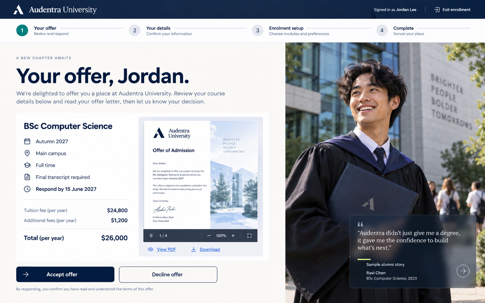

# Audentra admitted-student enrollment design

Open /motion-concept with TEST_MODE=true. This Northbridge University journey is a responsive, local-only design preview, separate from the active portal. It makes no backend requests, creates no account, accepts no issued offer, verifies no identity, and issues no student credential. Jordan Lee and all academic and financial terms are sample content.

The whiteboard sketches provided on 24 September 2026 set the layout and step order. The visual concept above guided the implemented offer screen; the running page is the current source for interaction and responsive review.

The supplied portrait welcome concept is adapted for desktop with the existing Northbridge campus image filling the scene, a light reading area for the greeting, a floating sample letter, an offer summary, and a prominent **Let’s go** action. Northbridge naming and green controls follow the requested journey branding. The letter is decorative preview content; the complete PDF is available on the next screen.

## Journey

| Step | Student action | Design outcome |
| --- | --- | --- |
| Welcome | Arrive from a one-time invitation and press **Let’s go** | Move from a college photograph into the offer |
| 1. Offer | Review program, term, condition, deadline, annual tuition and fees; open or close the letter preview dialog, open its PDF, then accept or decline | The graduate photo appears first, followed by the illustrative Northbridge diploma and attributed Ralph Waldo Emerson quote. Accept shows a short confetti transition. Decline asks for a reason and explicit confirmation |
| 2. Access | Enter email and matching 12-character passwords, or select Google, Apple or Facebook | Save activates when all fields contain text and shows specific validation on submit. Social buttons demonstrate the proposed redirect into the next screen, without contacting a provider |
| 3. ID card | Click the circular portrait to upload or replace and crop a photo; enter the full legal name exactly as shown on the ID; add front and back ID images; click Finish | Photo and name share one row. The front and back cards update live on a dark preview panel. Finish validates the fields and runs the mock check in one action, then opens the celebration only on a successful current result. Edits invalidate an in-flight check |
| Celebration | View an animated milestone card | Choose pending enrollment tasks or campus opportunities and events; select Story 9:16 or Post 1:1, download a short video, then open a social destination to post it yourself |

The share video contains no legal name, student ID number, uploaded ID, face photo, or claim that enrollment is complete. Video export requires browser canvas capture and MediaRecorder support; the format is MP4 or WebM according to browser support. Social links open the selected site without publishing automatically.

The progress bar lets students revisit each unlocked step. Returning to a previously visited screen preserves locally entered ID details within the current preview session; future steps remain locked until reached. The offer quote uses larger type directly over the photograph, with no separate opaque quote panel.

At 1280 × 720 and 1024 × 768 desktop viewports, sign-in, invitation, welcome, offer, access, ID, celebration, pending tasks, and campus opportunities keep their main controls visible without page scrolling. The full letter remains readable in a bounded dialog; only its document area scrolls on short viewports. Smaller mobile layouts continue vertically so fields and card details remain legible. The preview uses a Northbridge green and gold palette for its student-facing journey; the platform-wide Audentra brand guide is unchanged.

## College-supplied content before launch

1. Welcome campus photograph and a second perspective for the access step, with usage rights and mobile crops.
2. Approved graduate imagery, an institution-approved quote with accurate attribution and usage rights, and college-approved diploma design. The Emerson text currently shown is sample content and does not claim a Northbridge alumni connection.
3. Authoritative offer data: program, study mode, campus, term, response deadline, conditions, tuition currency and billing period, mandatory fees, deposit, aid/scholarship status and complete issued PDF. Keep the summary and PDF on the same offer version.
4. College sign-in policy and configured Google, Apple or Facebook client/redirect details for any provider that should actually be offered. The active student sign-in policy currently allows email/password only; these social buttons are design choices in this isolated preview.
5. Student ID branding and issuance rules, accepted identity document types by jurisdiction, face/ID review policy, retention/deletion policy, and accessibility/privacy copy.
6. Real opportunities and events feed, including dates, locations and sign-up destinations.

## Backend integration boundary

- Bind the one-time invitation to an admitted student and tenant. Expire and consume it server-side; never treat a route visit as proof of identity.
- Return an authoritative versioned offer and its private PDF. Record acceptance or decline idempotently with timestamps, offer version and audit trail. A client animation must follow server confirmation.
- Create an account or bind a social provider only after a real callback and server-side session; a clicked provider button is not evidence of sign-in.
- Upload portrait and ID sides privately. A real verification result should be linked to the authenticated student and be server-authoritative. Support pending, needs-review, mismatch, retry and approval states before issuing any student ID.
- Never include government ID imagery or legal identity details in a share asset. Build the public share card separately from private enrollment data.

The local check deliberately does not read images. It simulates a mismatch when a selected filename contains “mismatch” so the error and retry experience can be tested. A third-party verifier such as Persona can provide configured document checks and review statuses; a name comparison by an LLM alone does not establish document authenticity or that the applicant is present.

## Local checks

Run npm test, npm run typecheck, and npm run build. The component tests cover the welcome-to-offer-to-access-to-ID path, offer details/PDF, decline dialog, password gating, social option handoff, ID validation and mismatch/retry, stale check protection, celebration, both destinations, and legacy sample-portal behavior. Browser QA checks the rendered desktop flow; the prototype remains disconnected from production services.
